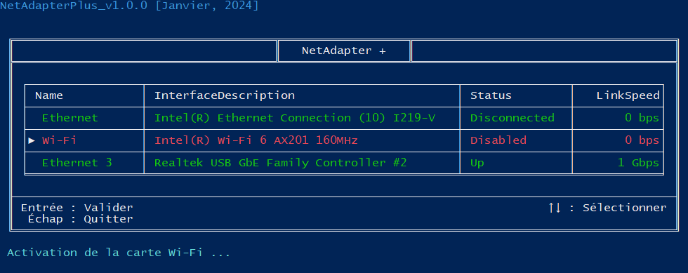

# **NetAdapter+**
## C'est quoi ce truc ?
Il s'agit d'un **script PowerShell** qui permet d'activer et de désactiver tes cartes réseau physiques plus rapidement et plus simplement que ne le permet le Centre Réseau et partage de Windows.

## Pour qui ?
Si tu es sur un environnement **Windows**, que tu es **administrateur** de ton poste, que tu aimes bien utiliser des petits scripts pour tout et pour rien et surtout si ça te prend la tête de ne pas pouvoir désactiver une carte réseau en trois clics, alors NetAdapter+ est fait pour toi !

## Comment ça s'installe ?
Pas de panique, PowerShell est inclut par défaut sur les systèmes d'exploitations Windows, tu dois juste récupérer mon script !

Tu devras ensuite t'assurer que l'**ExecutionPolicy** de ton PowerShell est défini au maximum sur "RemoteSigned". \
Il faut alors lancer PowerShell en tant qu'administrateur et exécuter la commande suivante :

    Set-ExecutionPolicy RemoteSigned